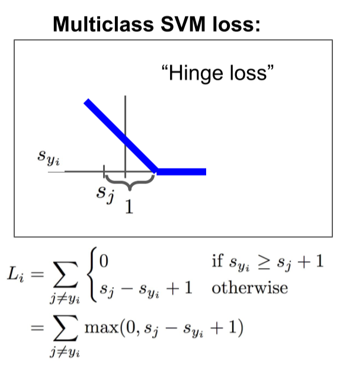
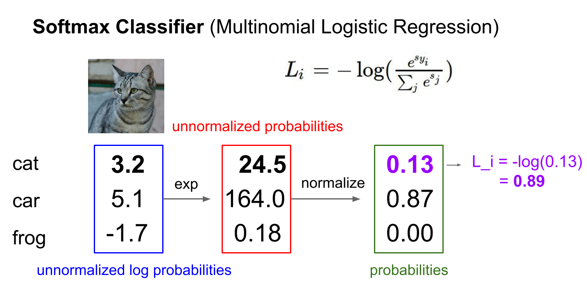
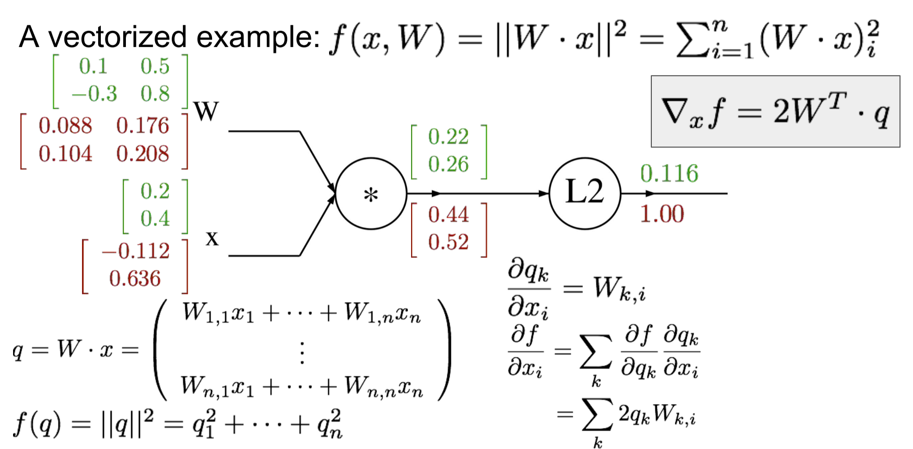
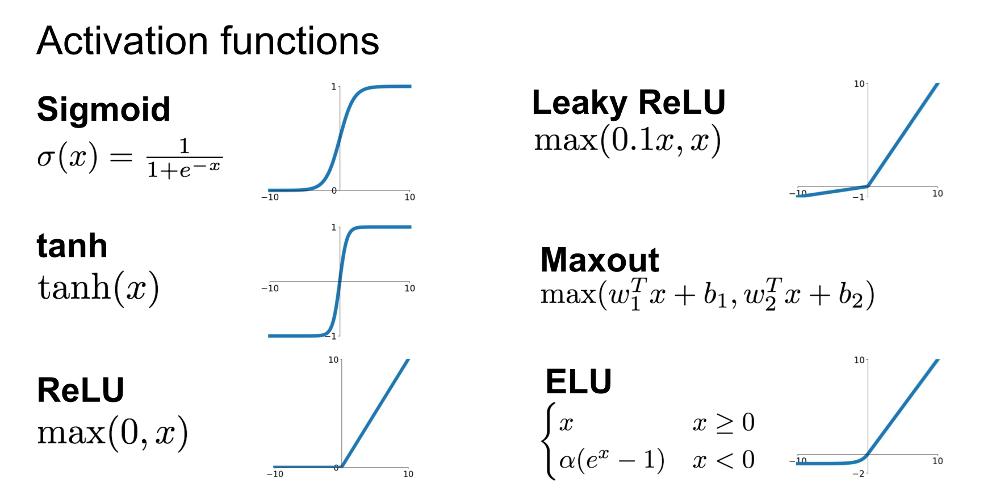
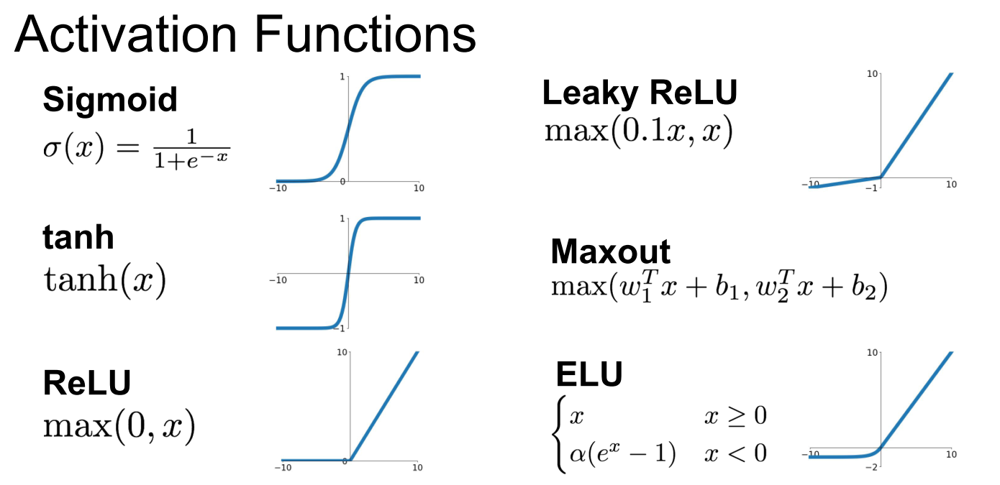
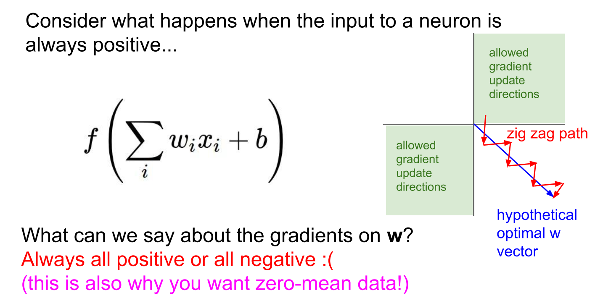
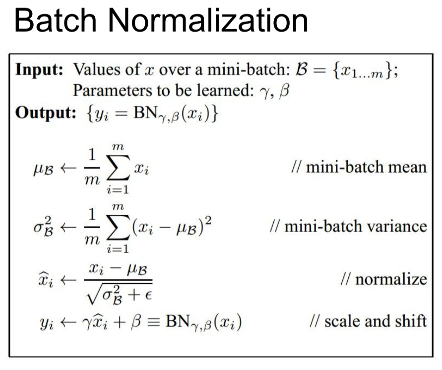

[TOC]

​	本文档主要记录学习cs231n课程（2017）内容的笔记。	cs231n是计算机视觉相关的斯坦福大学课程，该课程主要就CNN模型进行讲解，其中也设计了一些基础的机器学习模型和算法，基本上每一章节都会有相应的实验内容来巩固学习。

# 资料

[Python Numpy Tutorial](cs231n.github.io/python-numpy-tutorial/)

[2017视频](http://www.mooc.ai/course/268/learn?lessonid=1819#lesson/1819)

[配套资料](http://cs231n.stanford.edu/syllabus.html)

# Lecture1 Introduction

​	课程一主要讲计算机视觉的发展史，计算机视觉的范畴，以及卷积神经网络在目前物体识别方面的重要地位。

# Lecture2 Image Classification pipeline

## KNN

​	课程二首先以图片分类讲解了最简单的机器学习算法knn。这里贴上最近邻代码。

~~~python
import numpy as np

class NearesetNeighbor:
  def __init__(self):
  	pass

  def train(self, X, y):
  	"""X is N x D where each row is an example. Y is 1-dimension of size N（X是NxD的训练集，y是n维的label）"""
  	self.Xtr = X
  	self.ytr = y

  def predict(self, X):
  	"""X is N x d where each row is an example we wish to predict label for(X是测试集)"""
  	num_test = X.shape[0]
  	#num_test是测试集的样例的个数
  	Ypred = np.zeros(num_test, dtype = self.self.ytr.dtype)

  	for i in xrange(num_test):
  		distances = np.sum(np.abs(self.Xtr - X[i,:]), axis = 1)
  		#这里用到了广播机制
  		min_index = np.argmin(distances)
  		#得到distances中的最小值的下标
  		Ypred[i] = self.ytr[min_index]
  	return Ypred
~~~

​	课程还有讲述距离的概念，一般距离用范式来阐述，这里就不一一赘述了。

​	课程也有提及到knn并不适用于处理图像，因为复杂度太高，距离运算不方便。

## Linear Classification

​	线性分类器，课程的叙述和一般的机器学习书籍内容相似，主要是引出优化和损失函数的问题，是lecture3的内容。

# lecture3 Loss Functions and Optimization

​	课程三主要讲损失函数和优化问题。

## Hinge  loss

​	hinge loss是一种可以用来求解间隔最大化的问题，典型的就是SVM问题的求解。简单来说对于一个测试样例，其正确分类类别为$a_i$，预测结果为$[a_1,a_2,...,a_i,...a_n]$，分类器对其预测带来的损失是：

| $L_i$ | $ = \sum_{j\not=y_i}max(0,a_j-a_i+1)$    |
| ----: | :--------------------------------------- |
|       | $=max(0,a_1-a_i+1)+max(0,a_2-a_i+1)+...+...max(a_n-a_i+1)$ |

代码：

~~~python
def L_i_vectorized(x,y,W):
  scores = W.dot(x)
  margins = np.maximum(0, scores - scores[y] + 1)
  margins[y] = 0
  loss_i = np.sum(margins)
  return loss_i
~~~

## Softmax Classifier

## Optimization

​	课程中主要讲梯度优化，简单来说就是对损失函数求导，得到梯度反馈到权值上。

# lecture4 Backpropagation and Neural Networks

## 前向传播代码

~~~python
#forward-pass of a 3-layer neural network
f = lambda x: 1.0/(1.0 + np.exp(-x))
x = np.random.randn(3, 1)
h1 = f(np.dot(W1, x) + b1)
h2 = f(np.dot(W2, h1) + b2)
out = np.dot(W3, h2) + b3
~~~

## Back propagation

​	第四讲只要讲的是反向传播，这里贴上两张对矩阵求导的推导，觉得蛮有意思的：

## Activation function

# lecture5 Convolutional Neural Networks

课程五是卷积神经网络的入门课程，这里先介绍一些术语：

输入图像input image大小为N x N；

卷积核（滤波器）的大小为K x K；

stride为步长，是卷积核每次移动的像素数，记为S；

pad为边缘填充0的个数记为P；

输出图像的大小计算公式为：( N - K + 2*P ) / S + 1 。

# Lecture6 Training Neural Networks, Part I

## 卷积网络overview

（1）：一次性设置（One time setup）：

激活函数（Activation functions）

预处理(Data 

Preprocessing)

权值初始化（Weight Initialization）

正则化(Regularization)

梯度检查(Gradient checking)；

（2）：动态训练（Training dynamics）：

观察学习过程（Babysitting the learning process）

参数更新（Parameter updates）

超参数优化（Hyperparameter optimization ）

（3）：评估（Evaluation）

模型装配（model ensembles）

## 激活函数优缺点

### Sigmoid

​	Sigmoid函数是之前应用最为广泛的函数，因为其函数在两端接近于饱和，有很好的解释性（适合作为阈值函数）以及良好的导数性质。但在实际应用中Sigmoid函数缺点很明显：

（1）容易出现梯度消失的现象（输入值过大过小，梯度为0；输入值为0时，梯度为无穷）；

（2）Sigmoid函数的输出值不是以0为中心的，梯度更新时，只能往正方向或负方向更新（前一个神经元经过激活函数的输出全为正，在对当前神经元的权值W求导时，结果即皆为正或皆为负）；

（3）Sigmoid有指数运算，计算代价太大。

### tanh（x）

​	虽然tanh()函数输出分布在（-1，1）,但还是会出现梯度消失的现象。

### ReLU

优点： ReLU 得到的SGD的收敛速度会比 sigmoid/tanh 快很多(如上图右)。有人说这是因为它是linear，而且梯度不会饱和；并且计算简单。

缺点：ReLU在训练的时候很”脆弱”，一不小心有可能导致神经元”坏死”。（由于ReLU在x<0时梯度为0，这样就导致负的梯度在这个ReLU被置零，而且这个神经元有可能再也不会被任何数据激活。如果这个情况发生了，那么这个神经元之后的梯度就永远是0了，也就是ReLU神经元坏死了，不再对任何数据有所响应）实际操作中，如果你的learning rate 很大，那么很有可能你网络中的40%的神经元都坏死了。 当然，如果你设置了一个合适的较小的learning rate，这个问题发生的情况其实也不会太频繁。

### Leaky ReLU

​	基本同ReLU，但是解决了ReLU神经元坏死的情况。

### Maxout

​	形式为$f(x)=max(w_1^Tx+b_1,w_2^Tx+b_2)$，是ReLU及Leaky ReLU的集成版，优点很明显，缺点是参数会增多。

### 建议

​	使用ReLU，但是注意设置学习率，可以尝试Leaky ReLU/Maxout/ELU

## Preprocess the data

​	数据归一化，作用：避免出现输入数据比较极端的情况（如输入全为正，则梯度更新方向则为正或为负），二者可以人为控制输入数据的分布，从而使得训练数据和测试数据尽可能分布相同。

## Weight Initialization

​	权值初始化是一个非常值得研究的领域，在激活函数为tanh的网络中：

（1）如果权值初始化过小（如$W=0.01*np.random.randn(fan_{in},fan_{out})$）,则在网络层数较深的网络中，激活值会趋近于0（网络层数较深时，权值累乘会接近于0）。

（2）如果权值初始化过大（如$W=1.0*np.random.randn(fan_{in},fan_{out})$）,则所有神经元会饱和，梯度为0。

（3）比较合理的权值初始化$W=np.random.randn(fan_{in},fan_{out}) / np.sqrt(fan_{in})$

​	**如果激活函数是ReLU，由于只有大于0的部分会被激活，所以激活函数为$W=0.01*np.random.randn(fan_{in},fan_{out}) / np.sqrt(fan_{in}/2)$**

## Batch Normalization

​	批量归一化通常是在全连接层和卷积层之后插入的，可以将输入数据的分布变为单位高斯函数。需要注意的是，批量归一化不仅仅是对每层网络输入数据的归一化，这里面还有一个变换重构的过程，目的是防止某层网络本身的作用是改变数据分布，这样就需要学习参数，让归一化的数据恢复到学习到的分布特征。批量归一化的优点有：

（1）改善了梯度在网络中的传播；

（2）允许更高的学习率；

（3）减少了网络对初始化的依赖程度；

（4）改善正则化策略，可以减少使用dropout层（每个输入数据都是经过其他所有样本经验化均值、方差归一化而来）。

## Babysitting the Learning Process

​	观察学习过程是为了监视训练过程，并及时调整超参数来获得比较好的结果。

### 完整性检查：

​	（1）：在网络刚初始化时，可以通过计算网络损失函数的值，来判定网络是否完整（如共有十个类别，网络应当有9成判断为错）。

​	（2）：从小数据集开始训练（此时网络足够复杂，可以完全拟合小数据集。）

### 确定学习率：

​	学习率过低，会导致loss值变化不大，收敛过慢；学习率过大，会导致网络不稳定。一般学习率设置为$[1e^{-3},1e^{-5}]$之间，采用交叉验证，选取最佳的学习率。

## Hyperparameter Optimization

​	超参数选取一般是在训练集上，选取几个粗略值，在几个epoch里进行交叉验证。粗略值可以通过经验选择，也可以通过随机选择。