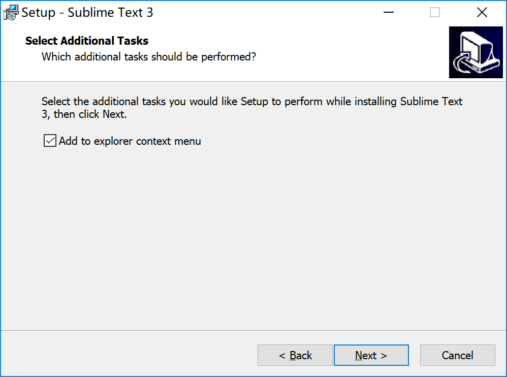
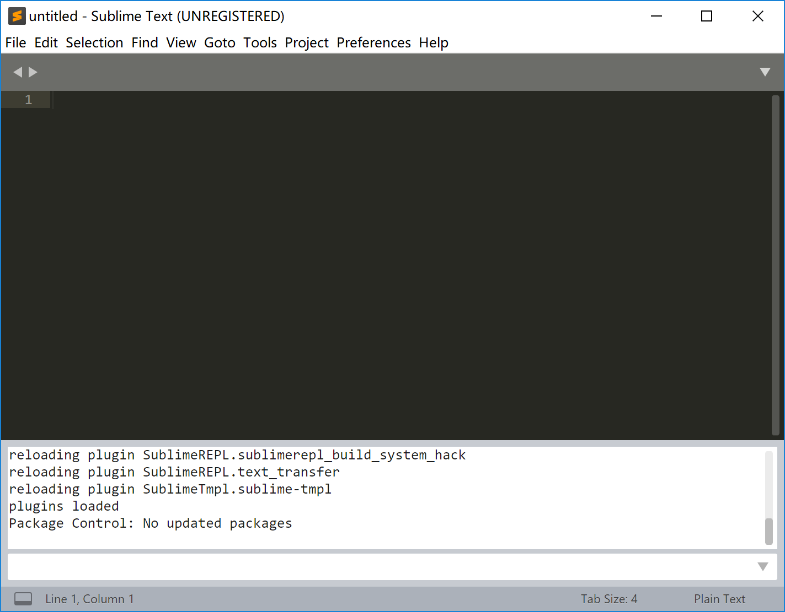
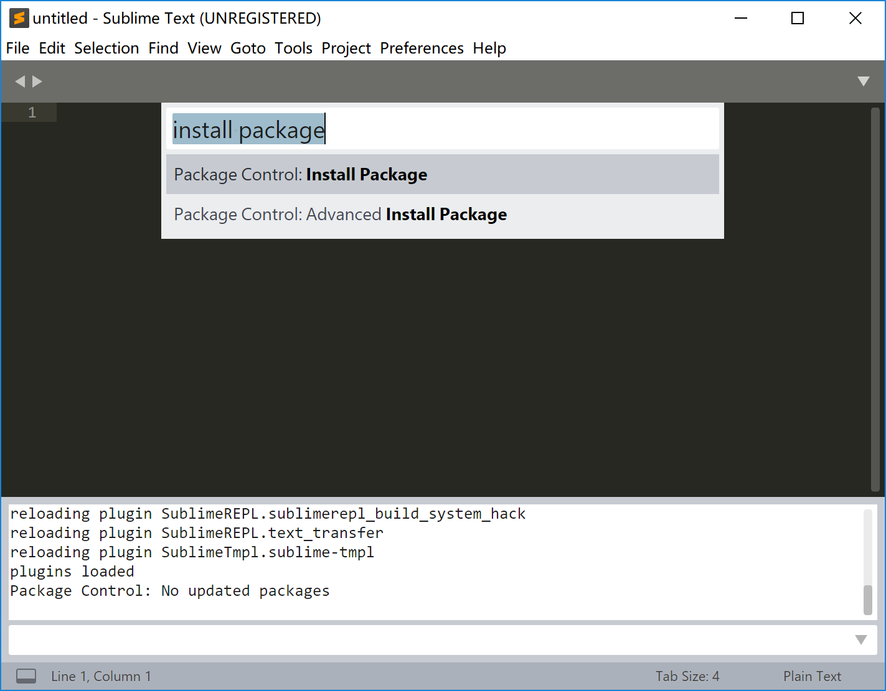
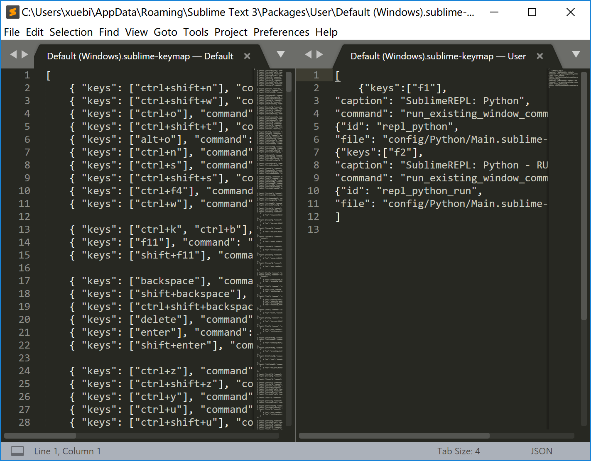

第一篇博客决定写sublime text3的使用（python版），sublime text3是因为偶然的原因发现的，陡然发现这个轻量级的编辑器很好用，安利一下。

# sublime text3的使用

## sublime text3的安装

sublime text3安装地址：[sublime text3](http://www.sublimetext.com/)

window用户直接下载安装就好了，注意安装过程中会有选择项如下：

这样Sublime Text可以被添加到右键中，在右键单击文件时，可以直接使用Sublime Text打开。

## 插件安装

sublime text3有很多插件其中只有Package Control是需要在控制台输入python代码安装的，其他插件都可以在Package Control中直接安装。下面我们开始安装Package Control插件

### Package Control安装

(1)首先需要在sublime text3界面键入：Ctrl+\`(\`符号是Esc键下面的键，也是~键)，键入后，sublime text3如下所示：

(2)在控制台输入部分（最后只有一行的小方框）输入代码（代码地址[官网](https://packagecontrol.io/installation#st2)）：

sublime Text3：

~~~python
import urllib.request,os,hashlib;
h = '6f4c264a24d933ce70df5dedcf1dcaee' + 'ebe013ee18cced0ef93d5f746d80ef60'; 
pf = 'Package Control.sublime-package'; 
ipp = sublime.installed_packages_path();
urllib.request.install_opener( urllib.request.build_opener( urllib.request.ProxyHandler()) ); 
by = urllib.request.urlopen( 'http://packagecontrol.io/' + pf.replace(' ', '%20')).read(); 
dh = hashlib.sha256(by).hexdigest(); 
print('Error validating download (got %s instead of %s), please try manual install' % (dh, h)) if dh != h else open(os.path.join( ipp, pf), 'wb' ).write(by)
~~~

sublime Text2：

~~~python
import urllib2,os,hashlib; 
h = '6f4c264a24d933ce70df5dedcf1dcaee' + 'ebe013ee18cced0ef93d5f746d80ef60';
pf = 'Package Control.sublime-package'; 
ipp = sublime.installed_packages_path(); 
os.makedirs( ipp ) if not os.path.exists(ipp) else None; 
urllib2.install_opener( urllib2.build_opener( urllib2.ProxyHandler()) ); 
by = urllib2.urlopen( 'http://packagecontrol.io/' + pf.replace(' ', '%20')).read(); dh = hashlib.sha256(by).hexdigest();
open( os.path.join( ipp, pf), 'wb' ).write(by) if dh == h else None; print('Error validating download (got %s instead of %s), please try manual install' % (dh, h) if dh != h else 'Please restart Sublime Text to finish installation')
~~~

之后就是安静的等待它安装完成了。

（3）安装完成之后，在sublime Text3界面键入：Ctrl+Shift+p,调出命令面板，输入picp（Package Control：Install Package），回车，如若出现下图所示，即安装完成。

否则重复上述步骤，或者选择手动安装，安装方法可见百度，或者官网。

### 其他插件安装

这里主要介绍两个插件，一个是代码提示插件SublimeCodeIntel用来代码提示，一个是SublimeTmpl，可以用来快速配置各种语言的模板。由于配置的方法类似，都是用之前安装的Package Control安装的，这里就只介绍SublimeCodeIntel的安装。

（1）键入Ctrl+Shift+p，进入Package Control命令面板；

（2）输入picp（会有默认选项）进入Package Control安装插件面板；

（3）输入SublimeCodeIntel，选中相应的插件安装即可。

这里介绍下SublimeTmpl自定义模板的使用，如若需要自己编辑的模板，见[配置](http://blog.csdn.net/u011254082/article/details/51669889):

~~~python
ctrl+alt+h #html模板
ctrl+alt+j #javascript模板
ctrl+alt+c #css模板
ctrl+alt+p #php模板
ctrl+alt+r #ruby模板
ctrl+alt+shift+p #python模板
~~~

# sublime Text3 的python交互

sublime Text3可以编辑多种语言，但是每次都要设置，这里为了方便python的交互使用，可以自己设置键位，如按F1进入python的ide界面，F2编译python文件。

## 安装SublimeREPL

（1）键入Ctrl+Shift+p，进入Package Control命令面板；

（2）输入picp（会有默认选项）进入Package Control安装插件面板；（3）输入SublimeREPL，选中相应的插件安装即可。

安装之后，通过选项Tools->SublimeREPL->Python，就能进入python的ide界面了

# 键位绑定

打开Preferences->Key Bindings-User，复制一下代码：

~~~python
{"keys":["f1"],
"caption": "SublimeREPL: Python",
"command": "run_existing_window_command", "args":
{"id": "repl_python",
"file": "config/Python/Main.sublime-menu"}}
~~~

即可实现按F1进入python的ide。

同理，复制代码（注意两份代码之间需要加逗号）

~~~python
{"keys":["f2"],
"caption": "SublimeREPL: Python - RUN current file",
"command": "run_existing_window_command", "args":
{"id": "repl_python_run",
"file": "config/Python/Main.sublime-menu"}}
~~~

即可实现按F2编译python文件（文件编辑之后必须按Ctrl+s保存后，才能编译）。（参考[知乎](https://www.zhihu.com/question/22904994)）

# 其他介绍

[拓展插件介绍](https://segmentfault.com/a/1190000004248611)

